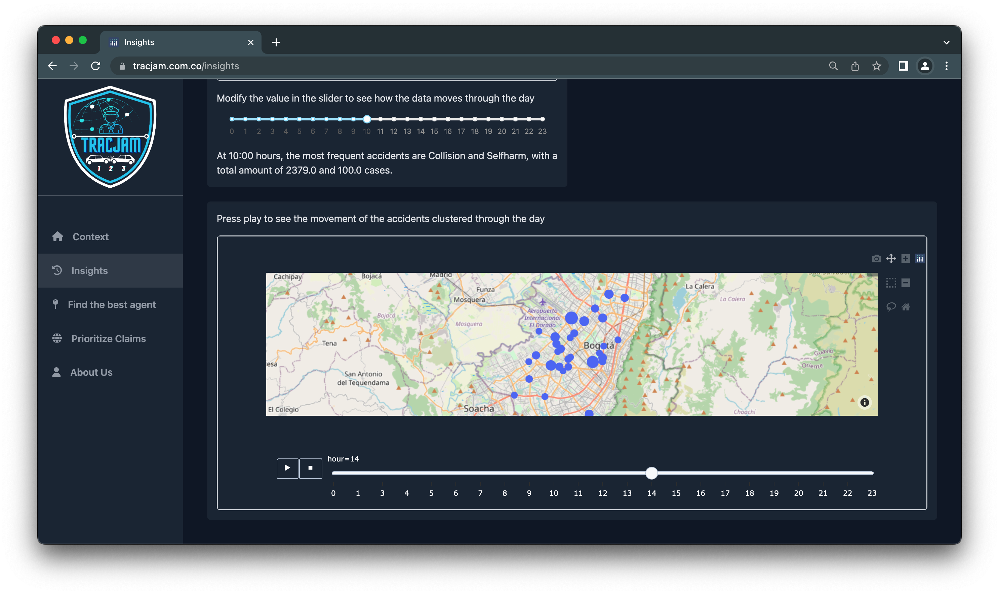
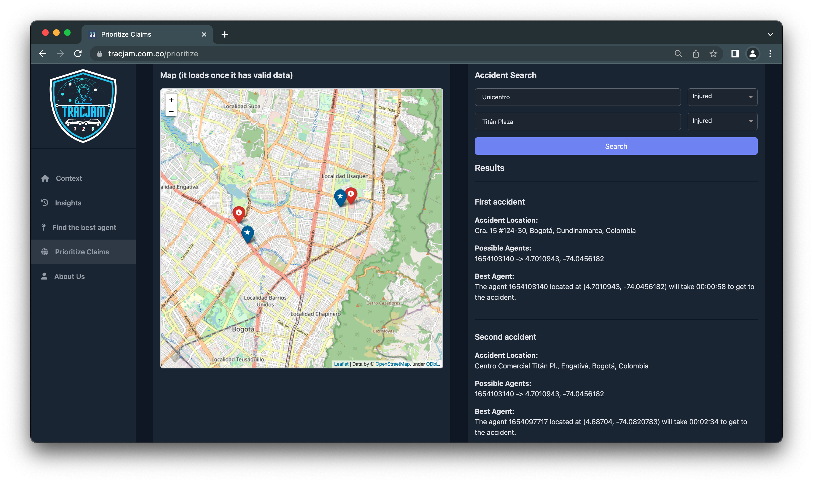

<div id="top"></div>

<div align="center">
  <a href="https://github.com/hrodriguezgi/ds4a-team23">
    
  </a>

  <h1 align="center">TracJam</h1>

  <p align="center">
   TracJam is a web application to coordinate and prioritize the agent's response to different traffic accidents in the city of Bogota in Colombia.
  </p>

  Deployed Project: [https://www.tracjam.com.co/](https://www.tracjam.com.co/ )
</div>


<!-- TABLE OF CONTENTS -->
<details>
  <summary>Table of Contents</summary>
  <ol>
    <li>
      <a href="#about-the-project">About The Project</a>
      <ul>
        <li><a href="#built-with">Built With</a></li>
      </ul>
    </li>
    <li>
      <a href="#getting-started">Getting Started</a>
      <ul>
        <li><a href="#prerequisites">Prerequisites</a></li>
        <li><a href="#installation">Installation</a></li>
      </ul>
    </li>
    <li><a href="#usage">Usage</a></li>
    <li><a href="#roadmap">Roadmap</a></li>
    <li><a href="#contact">Contact</a></li>
    <li><a href="#acknowledgments">Acknowledgments</a></li>
  </ol>
</details>


<!-- ABOUT THE PROJECT -->
## About The Project

[](https://tracjam.com.co)

TracJam is a web application to coordinate the response and prioritize the agent's shifts to different traffic accidents in the city of Bogota in Colombia. Our solution consist of two main parts. 


### Insights

This part of the solution is based on all the EDA made on the datasets and the main goal is to make multiple functions and calculations to show on the app as crucial facts to help make decisions across the city mobility. The first insight that we wanted to show was, how the incident locations cluster in Bogotá depending on the hour of the day. To do this we first needed to clean the data as there were a few incidents with clearly incorrect date attributes. Another important thing to do is to choose the right type of visualization so that the insights are easy to understand and provide a useful tool in the decision making process. Other insights we have gathered are the most common types of vehicles implicated in the incidents, we selected a barplot as these represent categorical data. These insights enable us to understand the history of incidents per locality, nonetheless it would be even better if we could predict the number of incidents per locality in the future. For this purpose we have proposed a predictive model using linear regression.



### Find Best Agent

The prioritization is based on a simple but effective algorithm that uses the realtime agent location that is provided by SDM, Mapquest API and Google maps API. The process starts with an accident report that contains the accident location that could be an address, coordinates, or a place. This will be typed, so we use the Google maps API to convert whatever the user types on a very close location with exact coordinates. When the accident is reported the algorithm starts to search for all the agents that are in a 1Km range of the accident, if the search is empty the algorithm will start increasing the range. When the agents are found it will start to use the mapquest API to calculate the time for each agent to get to the accident location. The algorithm will select the agent with the lower time and will show it on the map along with the route that the agent needs to follow and the location of the other agents.


### Prioritize Claims

Based on the previous algorithm, in this case there are two different accidents with their different categories. The process will initially determine if the locations of both accidents are distant (greater than 1.5km) or close. In the first case, the agents will be assigned independently, and in the second case, the possible agents of each accident must be evaluated and the times of the best agent for each one must be determined. If the best agent is different for each accident, it will remain so, if it is the same, which accident attends in the shortest time will be evaluated, and the next one with the shortest time on the list will be assigned to the other accident.




<p align="right">(<a href="#top">back to top</a>)</p>


### Tech Stack

* [![Python][Python.com]][Python-url]
* [![Dash][Dash.com]][Dash-url]
* [![Plotly][Plotly.com]][Plotly-url]
* [![Pandas][Pandas.com]][Pandas-url]
* [![Sklearn][sklearn.com]][sklearn-url]
* [![Flask][Flask.com]][Flask-url]
* [![PostgreSQL][PostgreSQL]][Postgresql-url]
* [![Heroku][Heroku.com]][Heroku-url]


<p align="right">(<a href="#top">back to top</a>)</p>


<!-- GETTING STARTED -->
## Getting Started

This app is deployed on website, however if you want to deploy it in your local machine you need to:
- Create an Api Key in [MapQuest](https://www.mapquest.com/)
- Create an Api Key in [Google Maps](https://cloud.google.com/apis)
- Create a `.env` file inside the path `project/app/src` based on the `.env.example` file.

### Option A (in case you don't have Docker)

This alternative will install all the resources locally.

To begin with, please follow the next steps to install the `requirements`:

```bash
# We assume you are in the root folder of the repo
cd project/app

# It's recommended to do the following command inside a virtual environment
pip install -r requirements.txt
```

Now, launch the application, but first make sure to navigate to `project/app/src`:

```bash
# We assume you followed the previous step
cd src
python app.py
```

This way you can go to `http://localhost:8050` and test the app.


### Option B (Using Docker)

This project can be launched using docker as an alternative to install everything locally 
(make sure to have Docker running on your machine).

You just have to be on the docker-compose root folder and launch the instance,
in other words, you can follow the steps below:

```bash
# We assume you are in the root folder of the repo
cd .devcontainer/python_server

docker-compose up -d --build
```

This way you can go to `http://localhost` and test the app.

<p align="right">(<a href="#top">back to top</a>)</p>

## Roadmap

- [ ] Enable automatic loads for datasets provided by the SDM, or enable the direct connect against the SDM databases.
- [ ] Get real time position of the agents to improve the time attentions.
- [ ] Transform the app into API, this way any entity could use the insights and the algorithm to deploy emergency teams.
- [ ] Enable speech to text to report an accident when a citizen calls to 123 emergency line.

<p align="right">(<a href="#top">back to top</a>)</p>


## Contact

* David Felipe Mora - [@github](https://github.com/DavidFM43) - [@linkedin](https://www.linkedin.com/in/david-felipe-mora/)
* Felix David Gomez Marin - [@github](https://github.com/FelixDavid12) - [@linkedin](https://www.linkedin.com/in/felix-david-gomez-marin/)
* Harvey Rodriguez Gil - [@github](https://github.com/hrodriguezgi) - [@linkedin](https://www.linkedin.com/in/hrodriguezgi/)
* Maria Fernanda Alvarez - [@github](https://github.com/mafelml) - [@linkedin](https://www.linkedin.com/in/mar%C3%ADa-fernanda-%C3%A1lvarez-fl%C3%B3rez-9aa35620b/)
* Sebastian Chavarriaga - [@github](https://github.com/schavar) - [@linkedin](https://www.linkedin.com/in/sebastian-c-0a0071219/)
* Victor Manuel Villamil Perez - [@github](https://github.com/vmvillamilp) - [@linkedin](https://www.linkedin.com/in/victorvillamil95/)

<p align="right">(<a href="#top">back to top</a>)</p>


<!-- ACKNOWLEDGMENTS -->
## Acknowledgments
This project is in part done, thanks to the help of the following institutions:

* [CorrelationOne](https://www.correlation-one.com/)
* [MinTIC](https://www.mintic.gov.co/portal/inicio/)
* [Secretaria Distrital de Movilidad](https://www.movilidadbogota.gov.co/web/)

<p align="right">(<a href="#top">back to top</a>)</p>


<!-- MARKDOWN LINKS & IMAGES -->
<!-- https://www.markdownguide.org/basic-syntax/#reference-style-links -->
[contributors-shield]: https://img.shields.io/github/contributors/github_username/repo_name.svg?style=for-the-badge
[contributors-url]: https://github.com/github_username/repo_name/graphs/contributors
[forks-shield]: https://img.shields.io/github/forks/github_username/repo_name.svg?style=for-the-badge
[forks-url]: https://github.com/github_username/repo_name/network/members
[stars-shield]: https://img.shields.io/github/stars/github_username/repo_name.svg?style=for-the-badge
[stars-url]: https://github.com/github_username/repo_name/stargazers
[issues-shield]: https://img.shields.io/github/issues/github_username/repo_name.svg?style=for-the-badge
[issues-url]: https://github.com/github_username/repo_name/issues
[license-shield]: https://img.shields.io/github/license/github_username/repo_name.svg?style=for-the-badge
[license-url]: https://github.com/github_username/repo_name/blob/master/LICENSE.txt
[linkedin-shield]: https://img.shields.io/badge/-LinkedIn-black.svg?style=for-the-badge&logo=linkedin&colorB=555
[linkedin-url]: https://linkedin.com/in/linkedin_username
[product-screenshot]: images/screenshot.png
[Plotly.com]: https://img.shields.io/badge/Plotly-%233F4F75.svg?style=for-the-badge&logo=plotly&logoColor=white
[Plotly-url]: https://plotly.com/
[Dash.com]: https://img.shields.io/badge/dash-%23150458.svg?style=for-the-badge&logo=plotly&logoColor=white
[Dash-url]: https://dash.plotly.com/
[Pandas.com]: https://img.shields.io/badge/pandas-%23150458.svg?style=for-the-badge&logo=pandas&logoColor=white
[Pandas-url]: https://pandas.pydata.org/
[Python.com]: https://img.shields.io/badge/python-3670A0?style=for-the-badge&logo=python&logoColor=ffdd54
[Python-url]: https://www.python.org/ 
[Heroku.com]: https://img.shields.io/badge/heroku-%23430098.svg?style=for-the-badge&logo=heroku&logoColor=white
[Heroku-url]: https://www.heroku.com/
[sklearn.com]: https://img.shields.io/badge/scikit--learn-%23F7931E.svg?style=for-the-badge&logo=scikit-learn&logoColor=white
[sklearn-url]: https://scikit-learn.org/
[PostgreSQL]: https://img.shields.io/badge/postgresql-%23316192.svg?style=for-the-badge&logo=postgresql&logoColor=white
[Postgresql-url]: https://www.postgresql.org/
[Postgres.com]: https://img.shields.io/badge/postgresql-%2523316192.svg?style=for-the-badge&logo=postgresql&logoColor=white
[Postgresql-url]: https://www.postgresql.org/
[Flask.com]: https://img.shields.io/badge/flask-%23000.svg?style=for-the-badge&logo=flask&logoColor=white
[Flask-url]: https://flask.palletsprojects.com/en/2.1.x/
